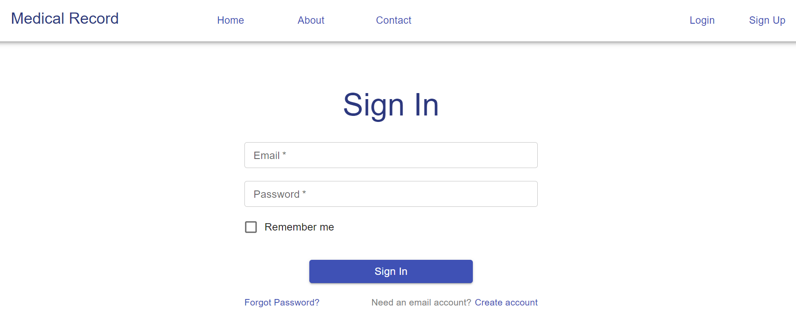
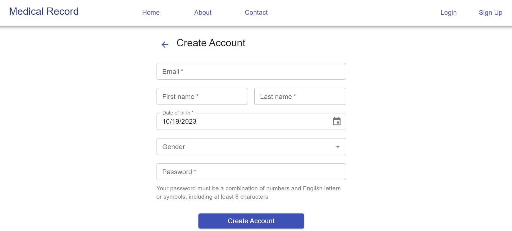
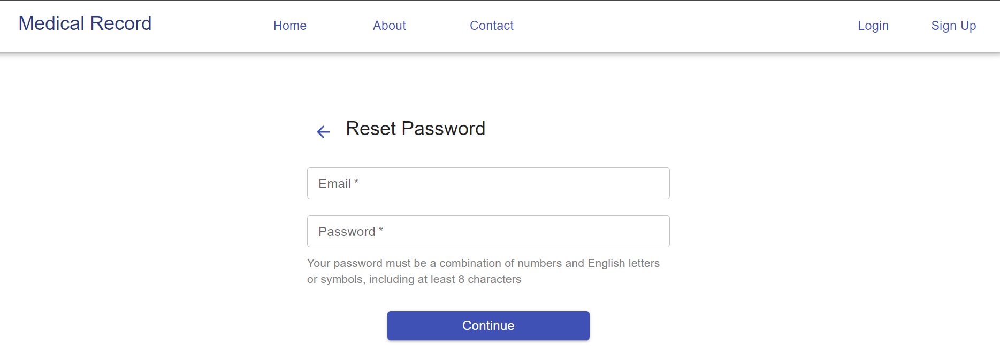
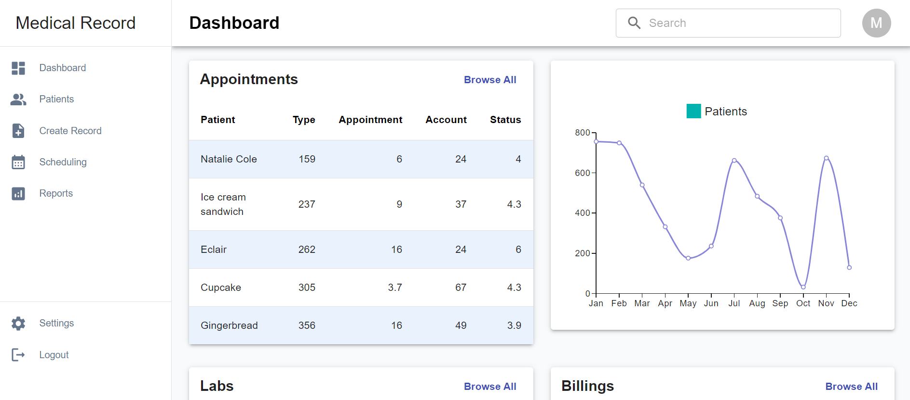

# Medical Record

## Table of Contents
1. [Overview](#Overview)
2. [Product Spec](#Product-Spec)
3. [Tech Stack](#Tech-Stack)
4. [Wireframes](#Wireframes)
5. [Mockups](#Mockups)
6. [Schema](#Schema)

## Overview
### Description
Medical Record web application aids healthcare providers in providing safer and more effective service to their patients. By allowing them to view up-to-date patients' documentation and share them to other involved parties such as healthcare insurance companies, this app aim to create a seamless communication experience between the providers, the providerd, and the involved third parties

### App Evaluation
- **Category**: Healthcare, Medical
- **Story**: Creates an intermediary that maximizes efficiency in providing healthcare services to patients

## Product Spec

### 1. User Stories 

**Required Must-have Stories**

As a user, I can
  * [ ] View on a visually pleasing homepage by default
  * [ ] Navigate between tabs (Home, About, Contact) on the navbar
  
As a doctor, I can
  * [ ] Create account on doctor portal
  * [ ] Log into my account
  * [ ] Navigate to tabs listed on sidebar
  * [ ] Search for information, including patients, appointments, tests and lab results, etc
  * [ ] View all patients personal and life-saving information
  * [ ] View all patients' appointments' details 
  * [ ] Add patients' medical records
  * [ ] Update patients' medical records
  * [ ] View details about a single patient

As a patient, I can
  * [ ] Create account on patient portal
  * [ ] Log into my account
  * [ ] Navigate to tabs listed on sidebar
  * [ ] Search for information, including appointments, medical records, medical bills, etc
  * [ ] View my personal information
  * [ ] View information about upcoming appointments
  * [ ] Set up appointment in available clinics
  * [ ] View details of each medical bill
  * [ ] Pay medical bill
  * [ ] Download clinical findings, diagnostic test and lab results
  * [ ] Print clinical findings, diagnostic test and lab results


**Optional Nice-to-have Stories**

* [ ] Undecided


### 2. Navigation

**Tab Navigation** 

* Home
* Contact
* Login
* Signup

**Flow Navigation** 

* Login
   => Dashboard
   => Account 
* Dashboard
   => Menu items
   => Search  
* Account 
   => Profile
   => Dashboard
   => Logout

## Tech Stack
* Frontend: Next.js, TypeScript, Material UI, Figma

## Wireframes
empty for now

## Mockups





## Schema 
### Models
#### User
 | Property      | Type     | Description |
   | ------------- | -------- | ------------|
   | userId      | String   | user id  |
   |          |      |  |
   |      |    |  |
   
#### Record
 | Property      | Type     | Description |
   | ------------- | -------- | ------------|
   |       |    |   |
   |          |      |   |
   |      |   |  |
   |          |      |   |
   |      |     |  |
   |      |    |   |

   
   
### Networking
#### List of network requests by screen

  - Blank for now

   

------------------------------------------------
This is a [Next.js](https://nextjs.org/) project bootstrapped with [`create-next-app`](https://github.com/vercel/next.js/tree/canary/packages/create-next-app).

## Getting Started

First, run the development server:

```bash
npm run dev
# or
yarn dev
# or
pnpm dev
```

Open [http://localhost:3000](http://localhost:3000) with your browser to see the result.

You can start editing the page by modifying `app/page.tsx`. The page auto-updates as you edit the file.

This project uses [`next/font`](https://nextjs.org/docs/basic-features/font-optimization) to automatically optimize and load Inter, a custom Google Font.

## Learn More

To learn more about Next.js, take a look at the following resources:

- [Next.js Documentation](https://nextjs.org/docs) - learn about Next.js features and API.
- [Learn Next.js](https://nextjs.org/learn) - an interactive Next.js tutorial.

You can check out [the Next.js GitHub repository](https://github.com/vercel/next.js/) - your feedback and contributions are welcome!

## Deploy on Vercel

The easiest way to deploy your Next.js app is to use the [Vercel Platform](https://vercel.com/new?utm_medium=default-template&filter=next.js&utm_source=create-next-app&utm_campaign=create-next-app-readme) from the creators of Next.js.

Check out our [Next.js deployment documentation](https://nextjs.org/docs/deployment) for more details.
